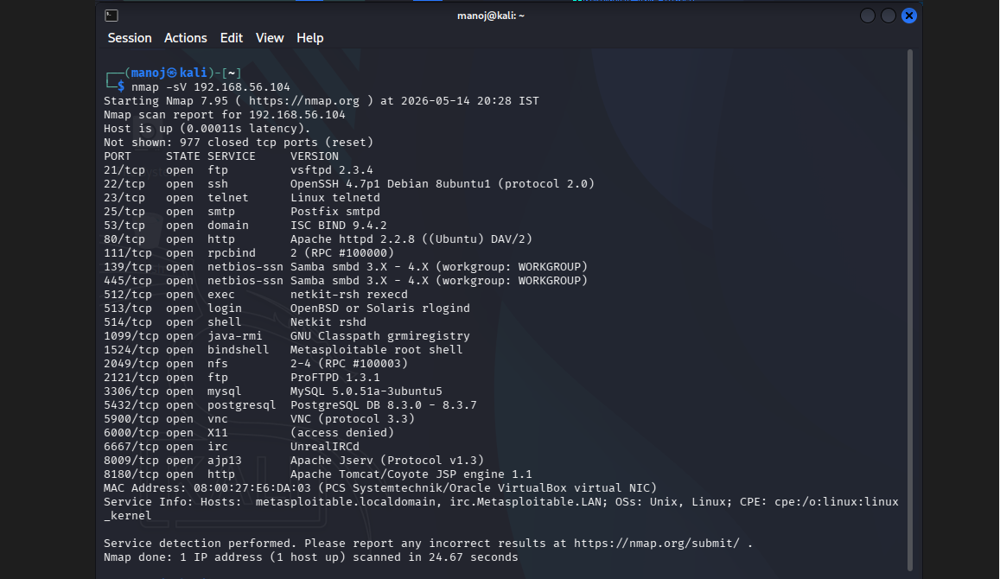
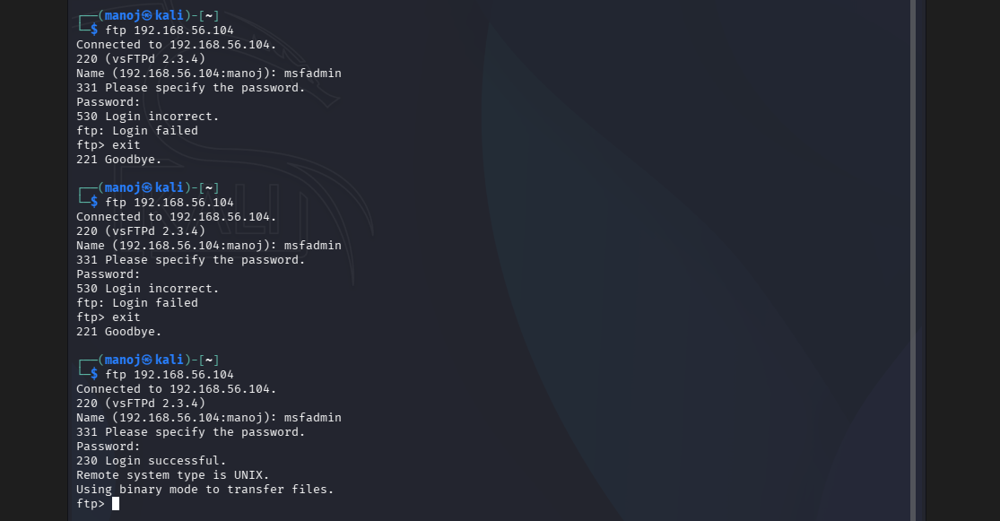
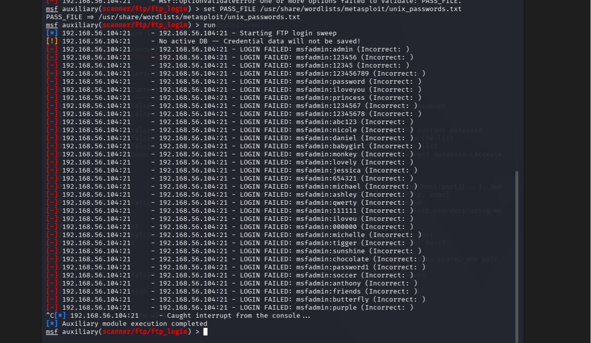
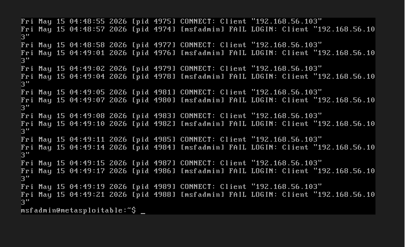
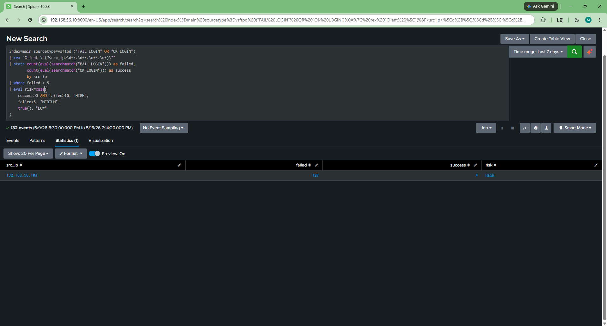
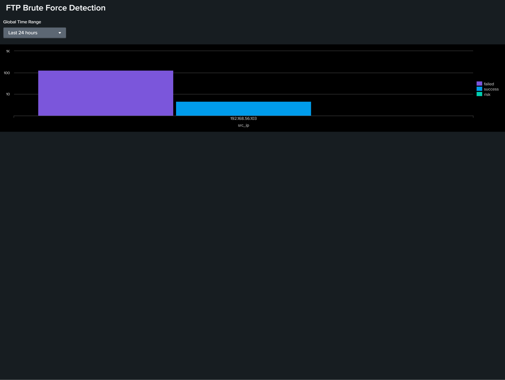

# FTP Brute Force Detection using Splunk

## Objective

This project simulates an FTP brute-force attack against a Metasploitable 2 machine and demonstrates how a SOC analyst can detect suspicious authentication activity using Splunk SIEM.

## Lab Setup

- Attacker Machine: Kali Linux
- Target Machine: Metasploitable 2
- SIEM Tool: Splunk Enterprise
- Environment: VirtualBox

## Reconnaissance

The target machine was scanned using Nmap to identify exposed services. The scan revealed that FTP service (vsftpd) was running on port 21.

Command Used:

nmap -sV 192.168.56.104

## Attack Simulation

After identifying the FTP service, manual authentication testing was performed to understand normal login behavior.

The FTP service was accessed using:

ftp 192.168.56.104

Both failed and successful login attempts were tested to generate authentication logs.

To simulate attacker behavior, Metasploit was used to perform an FTP brute-force attack.

Metasploit Module Used:

use auxiliary/scanner/ftp/ftp_login

Wordlist Used:

/usr/share/wordlists/metasploit/unix_passwords.txt

The attack generated multiple failed login attempts against the FTP service, creating realistic brute-force activity for detection and analysis.

## Log Analysis

FTP authentication logs were analyzed from:

/var/log/vsftpd.log

The logs contained:

- FAIL LOGIN events
- OK LOGIN events
- Client IP addresses
- Authentication activity timestamps

These logs provided evidence of brute-force behavior and were later ingested into Splunk for analysis.

## Splunk Detection

The FTP logs were uploaded into Splunk using:

- Index: main
- Sourcetype: vsftpd

A detection query was created to identify suspicious FTP authentication activity.

Detection Query:

index=main sourcetype=vsftpd ("FAIL LOGIN" OR "OK LOGIN")
| rex "Client \"(?<src_ip>\d+\.\d+\.\d+\.\d+)\""
| stats count(eval(searchmatch("FAIL LOGIN"))) as failed,
count(eval(searchmatch("OK LOGIN"))) as success
by src_ip
| where failed > 5
| eval risk=case(
success>0 AND failed>10, "HIGH",
failed>5, "MEDIUM",
true(), "LOW"
)

## Detection Logic

The detection identifies:

- Repeated failed FTP login attempts
- Suspicious activity from a single source IP
- Successful authentication following multiple failures
- Potential brute-force attack behavior
- Risk severity based on attack patterns

Risk Classification:

- HIGH: Multiple failures followed by successful login
- MEDIUM: Multiple failed attempts without success
- LOW: Minimal suspicious activity

## Dashboard Visualization

A Splunk dashboard was created to visualize:

- Failed login attempts
- Successful logins
- Source IP activity
- Risk classification

This enables analysts to quickly identify suspicious authentication behavior and prioritize investigations.

## Screenshots

### 1. Nmap Service Enumeration

### 2. Manual FTP Authentication

### 3. FTP Brute-force Attack Simulation

### 4. FTP Authentication Logs

### 5. Splunk Detection Results

### 6. Dashboard Visualization

## Outcome

This project successfully demonstrated how a Security Operations Center (SOC) analyst can detect FTP brute-force attacks using Splunk SIEM.

Key achievements:

- Identified exposed FTP service through reconnaissance
- Generated realistic brute-force attack activity
- Collected and analyzed FTP authentication logs
- Extracted attacker source IP information
- Built Splunk detection logic for repeated authentication failures
- Classified attack severity using risk-based detection
- Created dashboard visualizations for monitoring and investigation

## Real-World Relevance

This detection approach is commonly used in SOC environments to identify brute-force attacks against exposed services. By monitoring authentication failures and correlating them with successful logins, analysts can quickly identify potential account compromise attempts and respond before attackers gain persistent access.

## Skills Demonstrated

- Splunk SIEM
- SPL Query Development
- FTP Log Analysis
- Detection Engineering
- Threat Detection
- Incident Investigation
- Brute-Force Detection
- Metasploit
- Nmap Enumeration
- Linux Log Analysis
- SOC Monitoring
- Cybersecurity Lab Simulation
